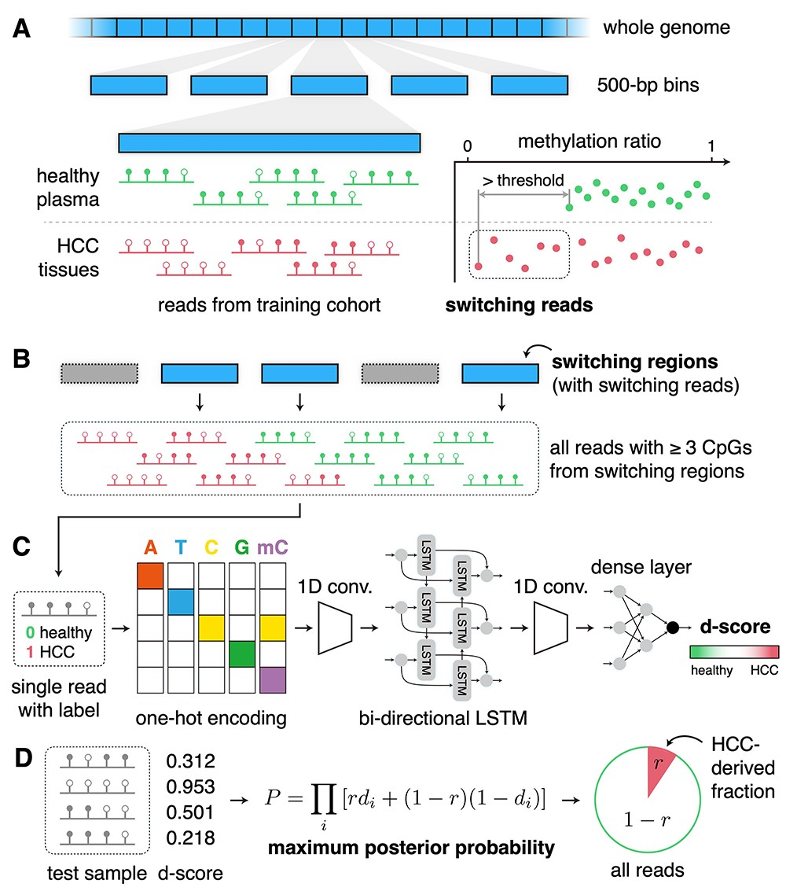

# DISMIR: *D*eep learning-based noninvasive cancer detection by *I*ntegrating DNA *S*equence and *M*ethylation information of *I*ndividual cell-free DNA *R*eads


Overview of DISMIR:  
(A) Identifying cancer-specific DMRs across the whole genome with the definition of switching regions and switching reads.  
(B) Collecting all reads with three or more CpG sites from switching regions for further analysis.  
(C) Training a deep learning model to calculate the d-score of each individual read.  
(D) Predicting tumor fraction of a sample by maximizing the posterior probability.  

---

Here we present the codes of DISMIR:

Files with prefix "DISMIR" are core codes

*DISMIR_training.py* builds and trains a deep learning model to predict the source of individual cell-free DNA reads. The input data files should contain following information:
* the first column: the chromosome where the read is from (e.g. chr1)
* the second column: the position of the read on chromosome (int format)
* the third column: the sequence of a read with a length of 66bp (A/T/C/G) in the form of 'str'
* the fourth column: the methylation state corresponding to the sequence also with a length of 66bp (1:methylated/0:unmethylated) in the form of 'str'
    
*DISMIR_predict_reads_source.py* predicts the source of each individual read with the trained model from *DISMIR_training.py*. The input files should have the same format as *DISMIR_training.py*.

*DISMIR_cal_risk.py* calculates the risk that the plasma donor is suffering from cancer with the results from *DISMIR_predict_reads_source.py*

Information about the environment we used:
* Python 3.8.3
* Tensorflow 2.2.0
* Keras 2.3.1


For testing the pipline, we generated several fictitious samples and put them in the directory "train_data" and "test_data". By putting them in the corresponding directory in *DISMIR_training.py* and *DISMIR_predict_reads_source.py* and changing the corresponding keyword in function "data_prepare", the core codes can be tested. With given fictious samples, the training result of *DISMIR_training.py* should be like:
> -loss: 0.3994 -accuracy: 0.8534 -val_loss: 0.4017 -val_accuracy: 0.8523

We also put the result file from *DISMIR_cal_risk.py* for reference (*value_result.txt* in the root directory)


For users to realize DISMIR, we also provided scripts to process *.BAM* files mapped with *BS-seeker2*. By running the script in "bam_processing" in order, you can get the *.BED* files containing switching regions and *.read* files as the input of the deep learning model. You can process your own data with these scripts and then realize DISMIR with the core codes. Here we need *samtools* to process the *.BAM* files. Python package *pyfaidx* and *pysam* are also required.

## Setup
```bash
pip install -r requirements.txt
ln -s train_data train_5_71
ln -s test_data person_5_71
mkdir train_dir
mkdir store_dir
```

## Run
```bash
python DISMIR_training.py
python DISMIR_predict_reads_source.py
python DISMIR_cal_risk.py
cat value_result_my.txt
```

# Citation
If you use this code for your research, please cite our paper:

Jiaqi Li, Lei Wei, Xianglin Zhang, Wei Zhang, Haochen Wang, Bixi Zhong, Zhen Xie, Hairong Lv, Xiaowo Wang, DISMIR: Deep learning-based noninvasive cancer detection by integrating DNA sequence and methylation information of individual cell-free DNA reads, Briefings in Bioinformatics, Volume 22, Issue 6, November 2021, bbab250, https://doi.org/10.1093/bib/bbab250
